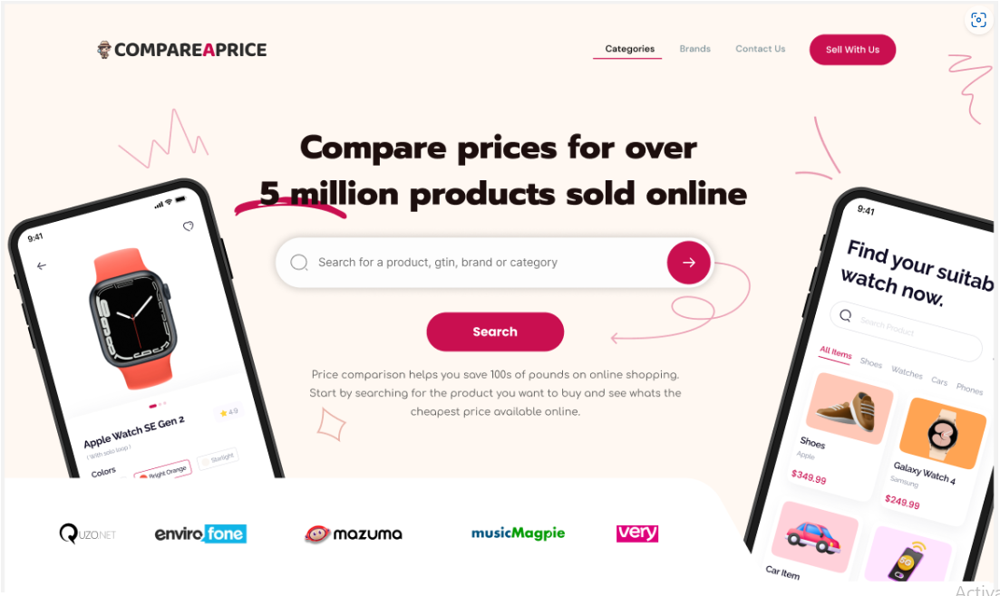

## Introduction
- This is build using ReactJs.
- Interview test conducted by Syhtek Software Solutions.
- Simple Ecommerce landing page which I was instructed to created in 24 hours.

Link to visit the website: https://devattaulnoor.github.io/react_interview_syhtek

## Technologies Used
- **Vite**: A fast build tool and development server for modern web projects. 
- **Reactjs**: A JavaScript library for building user interfaces.
- **Tailwind CSS**: A utility-first CSS framework for rapidly building custom designs.
- **react-icons**: A library for popular icons to be easily included in React projects.

## Getting Started
1. Clone the repository: `git clone https://github.com/DevAttaulNoor/react_interview_syhtek.git`
2. Navigate to the project directory: `cd react_interview_syhtek`
3. Install dependencies: `npm install`
4. Run the application: `npm run dev`

## License
This project is licensed under the DevAttaulNoor.

## Contact
If you have any questions or suggestions, feel free to contact the project maintainer at attaulnoor2001@gmail.com

 

## Interview
- **Question**: Please create the same design attached below using ReactJs.
- **Tec Stack**: ReactJS

